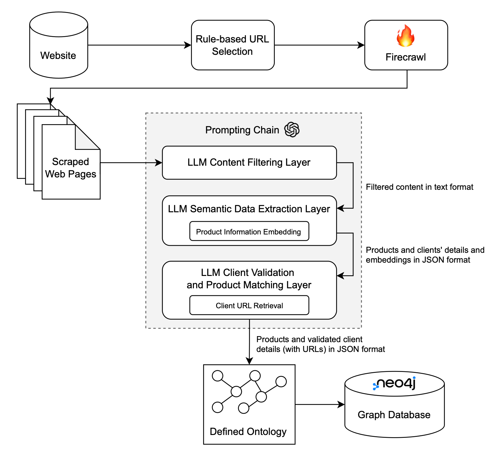

# End-to-End Knowledge Graph Construction for FinTech Ecosystem

## Introduction
This repository presents a method for constructing a comprehensive Knowledge Graph (KG) focused on the FinTech ecosystem. It aims to capture and analyse intricate relationships among companies, product and clients within the sector. The project leverages data from 791 targeted FinTech companies sourced from the PitchBook dataset.

Utilising the `Firecrawl` web scraping tool powered by large language models (LLMs), the project extracts detailed information directly from company websites. This forms a rich base dataset, which is then structured into a knowledge graph using a three-layer prompting chain of LLMs, enhancing the semantic understanding and linkage of data across multiple dimensions.

## Architecture
Below is the architecture diagram demonstrating the design of the prompting chain used in this project:



## Setup Instructions

### Prerequisites
Ensure you have Python installed on your machine. Python 3.8 or later is recommended.

### Installation
1. Clone the repository:
   ```bash
   git clone https://github.com/MC-Kangan/LLM-Enhanced-Knowledge-Graph-for-Startup-Analysis.git
2. Install required packages:
    ```bash
    pip install -r requirements.txt

### Configuration
1. Create a .env file in the main directory to store sensitive API keys and passwords:
    ```text
    NEO4J_PASSWORD=your_neo4j_password
    FIRECRAWL_KEY=your_firecrawl_key
    OPENAI_KEY=your_openai_key
    GOOGLE_SEARCH_KEY=your_google_search_key
    SEARCH_ENGINE_ID=your_search_engine_id

2. Define the names of the folders that will be used to save data in the .env file. The fintech or client scraping folders save the web scraping outputs; The summary folders save the outputs from the LLM Content Filtering Layer; Most importantly, the extraction folders save the outputs from the LLM Semantic Data Extraction layer and the LLM Client Validation and Product Matching layer, as shown in the architecture diagram above:
    ```text
    fintech_scraping_folder = "fintech_scraping_output"
    fintech_summary_folder = "fintech_summary_output"
    fintech_extraction_folder = "fintech_extraction_output"
    
    client_scraping_folder = "client_scraping_output"
    client_summary_folder = "client_summary_output"
    client_extraction_folder = "client_extraction_output"

3. The knowledge graph construction step requires a Neo4j graph database (DBMS) to be active and accessible. This project creates and uses the graph database locally via the Neo4j Desktop application. See https://neo4j.com/docs/getting-started/get-started-with-neo4j/ for more relevant information.
    

### File Structure
The file structure is introduced below:
```shell
    /LLM-Enhanced-Knowledge-Graph-for-Startup-Analysis
    ├── data/                      # Data directory for storing raw and processed data (not open-sourced)
    ├── working_notebooks/         # Jupyter notebooks for developments and experiments
    ├── evaluation/                # Code and data file for evaluating LLM's performance on a product attribute value extraction task
    ├── fintech_scraping_output/   # Folder for scraping outputs (not visible on Github)
    ├── fintech_summary_output/    # Folder for summary outputs (not visible on Github)
    ├── fintech_extraction_output/ # Folder for extraction outputs (not visible on Github)
    ├── client_scraping_output/    # Folder for scraping outputs (not visible on Github)
    ├── client_summary_output/     # Folder for summary outputs (not visible on Github)
    ├── client_extraction_output/  # Folder for extraction outputs (not visible on Github)
    ├── main.py                    # Code that runs the entire pipeline in a test mode
    ├── neo4j_utility.py           # Code that connects to Neo4j for knowledge graph construction
    ├── llm_extraction.py          # Code that connects to OpenAI for prompting chains and other LLM-related functions
    ├── firecrawl_scraping.py      # Code that connects to Firecrawl API for data scraping and crawling
    ├── utility.py                 # Utility functions file
    ├── pipeline.ipynb             # Jupyter notebook that introduces the entire pipeline step by step (IMPORTANT)
    ├── pitchbook.ipynb            # Jupyter notebook that conducts exploratory analysis on the PitchBook dataset
    ├── clustering.ipynb           # Jupyter notebook that conducts clustering analysis to group similar products based on product description
    ├── graph_rag.ipynb            # Jupyter notebook that explores a basic graph-rag system for Q&A
    ├── requirements.txt           # The file listing all project dependencies
    ├── .env                       # Environment variables file
    └── README.md                  # The README file you are currently reading


